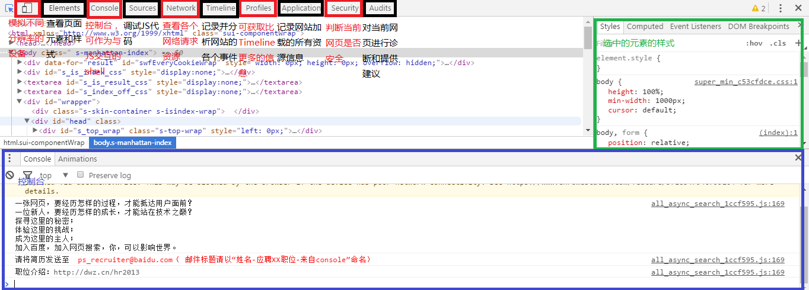

## CSS的全称是什么?
层叠样式表(英文全称：Cascading Style Sheets)

## CSS有几种引入方式? link 和@import 有什么区别?
### css的引入方式
* 直接在html标签内写css样式
* 在style声明中写css样式
* 使用@import引用css文件，比如

> @import url(style.css);
或
@import "style.css";

  注意：行尾的`;`不能省略

* 使用`<link />`引入css文件

> <link href="style.css" rel="stylesheet" type="text/css"/>

###link和@import的区别
* `<link>`是XHTML标签，除了可以引用样式表，还可以引用其他类型的文件，而@import只能加载css
* `<link>`无兼容问题，而@import不能在低版本浏览器中兼容
* `<link>`引用的css在页面加载时同时被加载，而@import要在页面完全载入后才会被加载
* `<link>`支持使用Javascript控制DOM去改变样式；而@import不支持

## 以下这几种文件路径分别用在什么地方，代表什么意思?
> css/a.css  
./css/a.css  
b.css  
../imgs/a.png  
/Users/hunger/project/css/a.css  
/static/css/a.css  
http://cdn.jirengu.com/kejian1/8-1.png

**相对路径**  
`css/a.css`指向当前目录下的css文件夹中的a.css文件  
`./css/a.css`和上面一样，`.`代表当前目录  
`b.css`指向当前目录下的b.css文件  
`../imgs/a.png`指向上级目录下的imgs文件夹下的a.png文件  
**绝对路径**  
`/Users/hunger/project/css/a.css`这是mac中的绝对路径，是真正在硬盘中的路径  
**网站路径**  
`/static/css/a.css`指向当前根目录下的static文件夹下的css文件夹下的a.css文件。路径最开始的`/`代表站点当前根目录  
`http://cdn.jirengu.com/kejian1/8-1.png`这是指向`cdn.jirengu.com`这个网站中的一个文件资源  

在实际生成中一般情况下都会使用相对路径，方便内容移动和测试。网站路径会在一些需要请求线上资源的情况下用到。

## 如果我想在js.jirengu.com上展示一个图片，需要怎么操作?
将图片上传到某个服务器上，生成一个网站路径，然后引用该路径

## 列出5条以上html和 css 的书写规范
* html规范
  1. 缩进层次分明
  2. 非特殊情况下样式文件在<head>...</head>中引用，JS文件在页面底部引用
  3. 语义化html
  4. 尽可能减少div嵌套
  5. 尽可能通过外部文件引入css
  6. 书写链接时，避免重定向，也就是在URL后加上`/`

* css规范
  1. 编码统一为UTF-8
  2. 要有一个base.css的文件，包含reset和头底部样式，每个页面都要引入该文件
  3. id是唯一且父级的，class是重复且子级的，因此id使用在大的模块上如：#header、#footer等
  4. 为JS预留的钩子命名要有一个前缀，比如js_、J_ 这样
  5. 命名要语义化，简明化
  6. 必须为大区块样式添加注释, 小区块适量注释;

## 截图介绍 chrome 开发者工具的功能区

