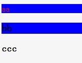

## class 和 id 的使用场景?
id是唯一且父级的，class是重复且子级的。因此id使用在大的模块上如：#header、#footer等，在样式有大量重复时使用class。

## CSS选择器常见的有几种?

|选择器|用途|
|---------|------|
|.info|class选择器，匹配所有class属性中包含info的元素|
|#info|id选择器，匹配所有id属性等于info的元素|
|*|通用元素选择器，匹配任何元素|
|E|标签选择器，匹配所有使用E标签的元素|
|E,F|多元素选择器，同时匹配所有E元素或F元素，E和F之间用逗号分隔|
|E F|后代元素选择器，匹配所有属于E元素后代的F元素，E和F之间用空格分隔|
|E > F|子元素选择器，匹配所有E元素的子元素F|
|E + F|毗邻元素选择器，匹配所有紧随E元素之后的同级元素F|
|E[att]|匹配所有具有att属性的E元素，不考虑它的值|
|E[att=val]|匹配所有att属性等于“val”的E元素|
|E[att~=val]|匹配所有att属性具有多个空格分隔的值、其中一个值等于“val”的E元素|
|E[att&#124;=val]|匹配所有att属性具有多个连字号分隔的值、其中一个值以“val”开头的E元素，主要用于lang属性，比如“en”、“en-us”、“en-gb”等等|
|E:first-child|匹配父元素的第一个子元素|
|E:link|匹配所有未被点击的链接|
|E:visited|匹配所有已被点击的链接|
|E:active|匹配鼠标已经其上按下、还没有释放的E元素|
|E:hover|匹配鼠标悬停其上的E元素|
|E:focus|匹配获得当前焦点的E元素|
|E:lang(c)|匹配lang属性等于c的E元素|
|E:first-line|匹配E元素的第一行|
|E:first-letter|匹配E元素的第一个字母|
|E:before|在E元素之前插入生成的内容|
|E:after|在E元素之后插入生成的内容|
|E ~ F|匹配任何在E元素之后的同级F元素|
|E[att^=”val”]|属性att的值以”val”开头的元素|
|E[att$=”val”]|属性att的值以”val”结尾的元素|
|E[att*=”val”]|属性att的值包含”val”字符串的元素|
|E:enabled|匹配表单中激活的元素|
|E:disabled|匹配表单中禁用的元素|
|E:checked|匹配表单中被选中的radio（单选框）或checkbox（复选框）元素|
|E::selection|匹配用户当前选中的元素|
|E:root|匹配文档的根元素，对于HTML文档，就是HTML元素|
|E:nth-child(n)|匹配其父元素的第n个子元素，第一个编号为1|
|E:nth-last-child(n)|匹配其父元素的倒数第n个子元素，第一个编号为1|
|E:nth-of-type(n)|与:nth-child()作用类似，但是仅匹配使用同种标签的元素|
|E:nth-last-of-type(n)|与:nth-last-child() 作用类似，但是仅匹配使用同种标签的元素|
|E:last-child|匹配父元素的最后一个子元素，等同于:nth-last-child(1)|
|E:first-of-type|匹配父元素下使用同种标签的第一个子元素，等同于:nth-of-type(1)|
|E:last-of-type|匹配父元素下使用同种标签的最后一个子元素，等同于:nth-last-of-type(1)|
|E:only-child|匹配父元素下仅有的一个子元素，等同于:first-child:last-child或 :nth-child(1):nth-last-child(1)|
|E:only-of-type|匹配父元素下使用同种标签的唯一一个子元素，等同于:first-of-type:last-of-type或 :nth-of-type(1):nth-last-of-type(1)|
|E:empty|匹配一个不包含任何子元素的元素，注意，文本节点也被看作子元素|
|E:not(s)|匹配不符合当前选择器的任何元素|
|E:target|匹配文档中特定”id”点击后的效果|

## 选择器的优先级是怎样的?对于复杂场景如何计算优先级？
1. 如果声明来自于“style”属性，而不是带有选择器的规则，则记为 1，否则记为 0 (= a)（HTML元素的style属性也是样式规则，因为这些样式规则没有选择器，因此记为a=1,b=0,c=0,d=0）
2. 计算选择器中 ID 属性的个数 (= b)
3. 计算选择器中其他属性(类、属性选择器)和伪类的个数 (= c)
4. 计算选择器中元素名称和伪元素的个数 (= d)

**有几点容易误解的地方在于：**
* 将四个数字按 a-b-c-d 这样连接起来（位于大数进制的数字系统中），构成选择器的优先级。并不存在低一级超出一定数目后导致高一级进一出现覆盖的情况。
* 四级（a、b、c、d）之间并不是简单的相加关系。同一级（例如：a对a）的才具有可比关系
* 根据css优先级计算规则，伪类的特殊性值是0,0,1,0，4个伪类的特殊性值相同，那么后面声明的规则优先级高。当鼠标滑过a链接时，满足:link和:hover两个伪类，要改变a标签的颜色，就必须将:hover伪类在:link伪类后面声明；同理，当鼠标点击激活a链接时，同时足:link、:hover、:active三种状态，要显示a标签激活时的样式（:active），必须将:active声明放到:link和:hover之后。因此得出LVHA这个顺序。这个顺序能不能变？可以，但也只有:link和:visited可以交换位置，因为一个链接要么访问过要么没访问过，不可能同时满足，也就不存在覆盖的问题。
* 具有！important的样式规则大于没有！important的样式规则，只有在同时具有！important属性时才会比较选择器的整体优先级

## a:link, a:hover, a:active, a:visited 的顺序是怎样的？ 为什么？
遵循爱恨原则LVHA”（LoVe HAte）
根据css优先级计算规则，伪类的特殊性值是0,0,1,0，4个伪类的特殊性值相同，那么后面声明的规则优先级高。当鼠标滑过a链接时，满足:link和:hover两个伪类，要改变a标签的颜色，就必须将:hover伪类在:link伪类后面声明；同理，当鼠标点击激活a链接时，同时足:link、:hover、:active三种状态，要显示a标签激活时的样式（:active），必须将:active声明放到:link和:hover之后。因此得出LVHA这个顺序。:link和:visited可以交换位置，因为一个链接要么访问过要么没访问过，不可能同时满足，也就不存在覆盖的问题。

## 以下选择器分别是什么意思?
\#header{} => id为header的元素  
.header{} => class为header的元素  
.header .logo{} => class为header的元素的后代元素中所有class为logo的元素  
.header.mobile{} =>  class既有header又有mobile的元素 
.header p, .header h3{} => class为header的p标签元素和class为header的h3标签元素  
\#header .nav>li{} => id为header的元素的后代元素中的class为nav的元素的子元素中的li标签元素
\#header a:hover{} => id为header的元素的后代元素中的a标签元素的hover状态  
\#header .logo~p{} => id为header的元素的后代元素中的class为logo的元素之后的所有同级p标签元素  
\#header input[type="text"]{} => id为header的元素的后代元素中的input标签元素，并且type属性为text  

## 列出你知道的伪类选择器

|选择器|用途|
|---------|------|
|E:first-child|匹配父元素的第一个子元素|
|E:link|匹配所有未被点击的链接|
|E:visited|匹配所有已被点击的链接|
|E:active|匹配鼠标已经其上按下、还没有释放的E元素|
|E:hover|匹配鼠标悬停其上的E元素|
|E:focus|匹配获得当前焦点的E元素|
|E:lang(c)|匹配lang属性等于c的E元素|
|E:enabled|匹配表单中激活的元素|
|E:disabled|匹配表单中禁用的元素|
|E:checked|匹配表单中被选中的radio（单选框）或checkbox（复选框）元素|
|E::selection|匹配用户当前选中的元素|
|E:root|匹配文档的根元素，对于HTML文档，就是HTML元素|
|E:nth-child(n)|匹配其父元素的第n个子元素，第一个编号为1|
|E:nth-last-child(n)|匹配其父元素的倒数第n个子元素，第一个编号为1|
|E:nth-of-type(n)|与:nth-child()作用类似，但是仅匹配使用同种标签的元素|
|E:nth-last-of-type(n)|与:nth-last-child() 作用类似，但是仅匹配使用同种标签的元素|
|E:last-child|匹配父元素的最后一个子元素，等同于:nth-last-child(1)|
|E:first-of-type|匹配父元素下使用同种标签的第一个子元素，等同于:nth-of-type(1)|
|E:last-of-type|匹配父元素下使用同种标签的最后一个子元素，等同于:nth-last-of-type(1)|
|E:only-child|匹配父元素下仅有的一个子元素，等同于:first-child:last-child或 :nth-child(1):nth-last-child(1)|
|E:only-of-type|匹配父元素下使用同种标签的唯一一个子元素，等同于:first-of-type:last-of-type或 :nth-of-type(1):nth-last-of-type(1)|
|E:empty|匹配一个不包含任何子元素的元素，注意，文本节点也被看作子元素|
|E:not(s)|匹配不符合当前选择器的任何元素|
|E:target|匹配文档中特定”id”点击后的效果|

## div:first-child和div:first-of-type的作用和区别
* div:first-child匹配的是父元素的第一个子元素为div标签的元素
* div:first-of-type匹配的是父元素的所有div子元素中的第一个

**区别：**
* div:first-child是先找出父元素的第一个子元素，若该元素为div，则该元素被匹配，若不是div，则不被匹配
* div:first-of-type是先找出父元素的所有div子元素，再匹配这些div子元素中的第一个。
* div:first-child更侧重结构，即如果第一个子元素不是div，后面有再多的div也是没用的。而div:first-of-type更侧重类型，只要子元素中有div，则就能匹配上。

## 运行如下代码，解析下输出样式的原因。
> 
 

   
aa

   <h3 class="item1">bb</h3>
   <h3 class="item1">ccc</h3>
 

样式如图：

解析：
* `.item1:first-child`这个选择器匹配的是父元素的第一个子元素的class为item1的元素。`
aa
`符合条件，是其父元素的第一个子元素并且class为item1。`<h3 class="item1">bb</h3>`和`<h3 class="item1">ccc</h3>`分别为其父元素的第二个、第三个子元素，不符合条件。
* `.item1:first-of-type`这个选择器匹配的是父元素的class为item1的子元素中*相同标签*中的第一个元素。`
aa
`是符合条件的，class为item1且是同级p标签中的第一个。`<h3 class="item1">bb</h3>`是符合条件的，class为item1且是同级h3标签中的第一个。`<h3 class="item1">ccc</h3>`则不符合条件，因为它是同级h3标签中的第二个
