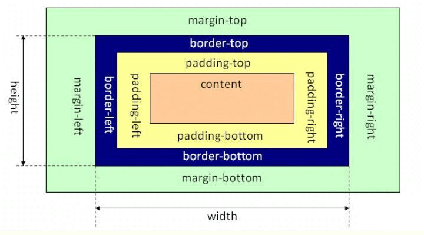
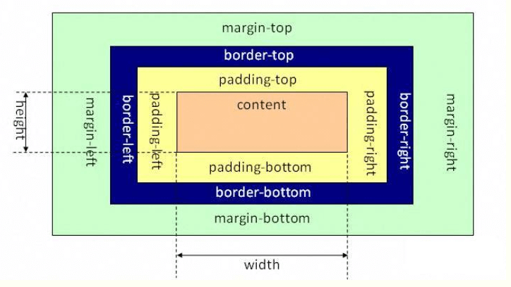

## text-align: center的作用是什么，作用在什么元素上？能让什么元素水平居中
* 设置文本或img标签等一些**内联元素**（或与之类似的元素）的居中

## IE 盒模型和W3C盒模型有什么区别?
* IE盒模型  
  
* 标准盒模型（W3C盒模型）  
  

区别：如图，W3C盒模型的height和width只包括content，而IE盒模型的包括content，padding，border。在IE8之前的IE浏览器使用的是IE盒模型。

## { box-sizing: border-box;}的作用是什么？
box-sizing设置元素的盒模型，有三个值：
* border-box：为元素指定的padding和border都会计算在width和height内，也就是采用了IE盒模型
* content-box：为元素指定的padding和border不会计算到width和height内，width和height值包括content，也就是采用了标准盒模型
* inherit：继承自父元素

## line-height: 2和line-height: 200%有什么区别?
在继承时会有区别
* `line-height: 2`：子元素继承的是2倍这个倍数，子元素会根据自己的font-size的值乘2计算出line-height，子元素自己的font-size对line-height有影响
* `line-height: 200%`：父元素先用font-size乘200%计算出line-height，子元素继承的是line-height这个值，子元素自己的font-size对line-height无影响

## inline-block有什么特性？如何去除缝隙？高度不一样的inline-block元素如何顶端对齐?
特性：
 
* inline-block 后的元素创建了一个行级的块容器，该元素内部（内容）被格式化成一个块元素，同时元素本身则被格式化成一个行内元素。也就是说inline-block 的元素既具有 block 元素可以设置宽高的特性，同时又具有 inline 元素默认不换行的特性
* 在每个元素之间会有间隙，这是inline中也有的问题，这些间隙是空白符。在浏览器中，空白符是不会被忽略的，多个连续的空白符浏览器会自动将其合并成一个。我们编写代码时写的空格，换行都会产生空白符，解决的方法有很多，比如

> 
`<a href="#">`  
`链接</a><a href="#">`  
`链接</a><a href="#">`  
`链接</a>`  

或者
> 
`<a href="#">链接</a><!--`  
`--><a href="#">链接</a><!--`  
`--><a href="#">链接</a>`  

或者使用font-size: 0，
* 在IE8以下有兼容性问题，可以这样解决

> 
 display:inline-block; 
*display:inline; 
*zoom:1;

## CSS sprite 是什么?
* CSS Sprites是把网页中一些图片整合到一张图片文件中，再利用CSS的“background-image”，“background-repeat”，“background-position”的组合进行背景定位。
* 优点：可以减少HTTP请求，提高页面性能
* 缺点：必须限制盒子的大小，否则会出现图片之间相互干预的情况，而且不好维护。

## 让一个元素"看不见"有几种方式？有什么区别?、
* display: none; 不占据空间，无法点击
* visibility: hidden; 占据空间，无法点击
* opacity: 0; filter:Alpha(opacity=0); 占据空间，可以点击
* margin:0; border:0; padding:0; height:0; width:0;height: 0; overflow: hidden; 不占据空间，无法点击 

注意：

1. display: none：完全不受transition属性的影响，元素立即消失。而且会引起reflow和repaint。父元素如果使用了display:none，后代元素即便再设置dispaly: block也没用了。
2. visibility: hidden：元素消失的时间跟transition属性设置的时间一样，但是没有动画效果。不会有reflow和repaint。父元素如果使用了visibility: hidden，后代元素再设置visibility: visibile 则会再显现出来
3. opacity和height等属性能够进行正常的动画效果

[代码1](http://js.jirengu.com/goko/1/edit?html,output)
[代码2](http://js.jirengu.com/zewo/1/edit?html,output)
